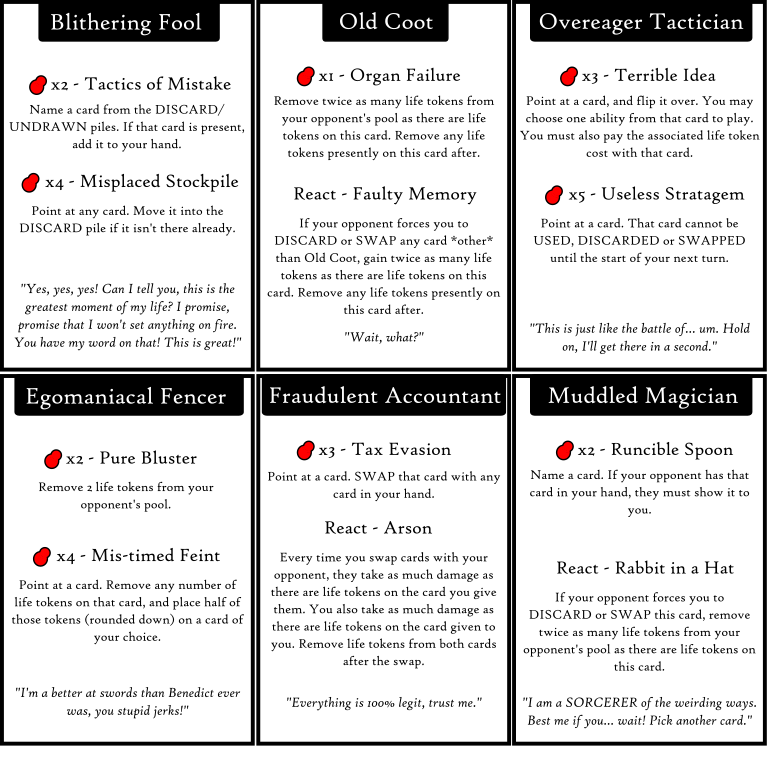

## Week 3 of Fall
I guess we're doing this. This whole idea started I-don't-know-how-many-years-ago when I wrote down an idea in the ideas section of my phone:

```
Card game where the player's teams and strategies are fluid.
Elaborating: Two players have teams, and they have to play cards to get other players on their teams. That means utnil the other players are recruited for a team, they have to develop a strategy that will work for either team.
```

I won't bother explaining what I mean by the above, because usually when I write down ideas it makes no sense to anyone but me. And if I ever do start working on an idea, it always comes out radically different from whatever I wrote down. But it's a good starting point.

When I started taking ARTG 80G in fall, and I heard that we were only making a card game, I thought about iterating on it, with one major twist:

The card game should be really basic in scope. One mistake I always make is adding more complicated features that sound really cool, but that I don't have time to elaborate on or tweak.

So how do you scale that down?

1. Make the game playable only between two players. That drastically reduces the need for balance.
2. Limit the total number of cards available. I was thinking of 10-12 cards total.
   a. Each player would draw five cards each from a shared pile.
   b. There might be like 2 unused cards, but that could create some interesting ideas.
3. To focus on fluidity, make it so that every card is unique.
    a. This is probably going to be hard to balance, but it's a challenge I really want to try.
    b. To mitigate the issue of players being able to see each other's cards to formulate strategies in advance, I'm borrowing Coup's system of hiding the cards/roles you have from your opponent. So you can make deductions of what your opponent probably has during play.

I was also inspired by Hearts (my dad was playing it consistently while I was home for the summer), and the idea of needing to lose cards. And I was also maybe inspired by the idea of swapping cards? So you're potentially more powerful while you have more cards, but you need to become less powerful in order to win.

So then came the idea:
Foole's Company - A game where you are the leader of an incompetent mercenary company, facing off against the leader of yet another incompetent mercenary company. You want to ditch your mercenaries before they get you killed.

### Current Goals
1. Pure strategy
   a. I don't want any luck to be involved. I haven't made a lot of games like this, so I think it'd be a good challenge.
   b. Creates a nice consequence that part of the game is going to be based on the available information you have.
2. Limited interactions/Simple mechanics
    a. Mostly for scope reasons, but I also think that if I focus on making things simple and/or easy to read, then it could create some complex strategies.
    b. You know, "easy to learn, hard to master"

### Current Rules
I've already iterated on this several times in my head, but here's what I have so far:

It's a 1v1 game. Two players only.

Each player draws 5 cards from the deck, keeping them hidden from each other. 2 cards remain in the center, face down. Every card is unique and has a unique ability.

At the start of the game, each player has 30 life tokens.

There will be some arbitrary process for deciding who goes first.

A player will lose X life tokens per turn, where X is the number of cards they have in their hand. So if a player ends a turn with 5 cards in their hand, they lose 5 life tokens.

Each card has abilities that can be activated for a certain number of life tokens. On their turn, a player selects as many cards as they'd like (introduce a limit?), reveals them to the other player and picks ONE ability from each card they have selected to use. (I might add cards where you have to store life tokens on them over multiple turns before activating? That allows you to hide more information over multiple turns)

The game ends when one player runs out of life tokens or loses all of their cards.

That's it! Excited to make some cards for this.

### Visual Style #1
So obviously, this shares *some* similarities with Magic the Gathering, because what's wrong with the classics?

You know, standard stuff! Name at the top, image in the center, abilities below:


Personally, I'm a big fan of minimalism (and in all honesty, minimal drawing is the only kind of drawing I can really do). So I just went for some really simple shapes.

I spent like 30 minutes or so designing a really basic rose out of a few shapes. I don't know if anyone else will interpret it as a rose, but that's what it's meant to be. Or at least a flower.

### Visual Style #2

I've kept the icons because I worked on them for longer than I probably should have, and I don't want to spend time designing new icons. They're pretty cool though, right? Well, the life counter icons probably need some work. But I kinda like the card back icon, so it's staying:


I also messed around with some font changes. It looks nice! I'm a little worried about readability, but I like `High Tower Text` as a font. Maybe I should ditch the cursive though for the card titles.

I've included the card name on the back as well as maybe another way of messing with information? I wonder if I should make it clear what cards everyone is holding? Something to experiment with, I guess.

I also tried making the information on the card a lot clearer, so there's no card icon. Just text, as well as a nice quote on the bottom. That means I can make the text bigger if I want, so there's less clutter going on.

### Visual Style #3

Alright, one more:


I thought maybe the back of the card wasn't crowded enough, so I added some more symmetry to make it look better? I also tried to stick with one font, and focused on removing as much unnecessary text as possible. It looks cleaner, but I'm not particularly thrilled because I kind of like writing quotes. Art is not my strong suit.

One potential thought, making the front and back of the card the same? Especially if I want people to be able to read information from other's hands.

## Week 4 of Fall

I had the weekend to think, so when I thought of something, I wrote it down!

Here are some card ideas:

Old Coot - Spontaneous Organ Failure, Back In My Day
Overeager Tactician - Useless Stratagem
Egomaniacal Fencer - Pure Bluster
Fraudulent Accountant - Tax Evasion
Muddled Magician - Runcible Spoon
Rebellious Youth - Reckless Endangerment, Child's Play
Clown - Honk
Bumbling Patroller - Must have been nothing
Useless Underminer - Do Nothing
Impious Pretender - Disheartening Service
Devious Drunkard - Extreme Hangovers


And some potential card abilities:

Swap cards with your opponent
Use one of your opponent's abilities (high cost + the ability's cost?)
Counterattack - Put life tokens on the character, if anything BUT the card is attacked, do life token damage or remove cards?
Other counterattack: Play immediate life tokens to stop any ability?
Directly attack opponent
Sap life tokens from opponent?
Reveal opponent cards (maybe by just asking if they exist?)
Heal yourself... somehow? Maybe by taking more cards?
Disable cards?
Give cards to your opponent (shouldn't be immediate)
Card is useless, discard for 4 extra life tokens???
Replace an ability's cost with drawing cards?
Rewind a turn?
Keep a card flipped over once it's been revealed.

And then I made this initial draft of cards yesterday (sort of, I updated the Accountant in between now and then):



Then I added the full set of cards that I plan on using in the final game:


I wanted 12 cards in total so that there would be 2 cards left over in an "unused" pile to contribute to the amount of misinformation that each player has. So initially, you're unsure of what cards your opponent has, and what's in the "unused" pile.

I also left a lot of the card descriptions vague on purpose to create for some interesting bending of the rules. This is obviously going to be super difficult to word correctly. But nonetheless, I have a plan. I need to write the rules first though:

### The Rules

