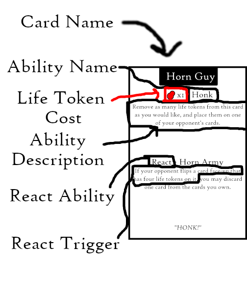
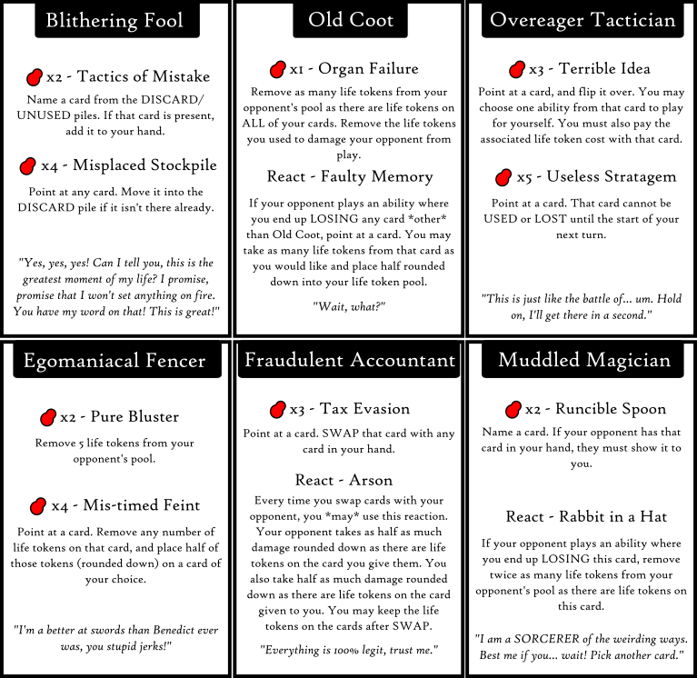
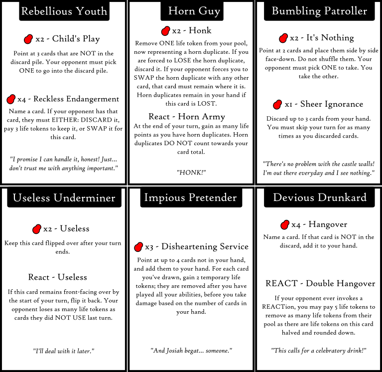

# The Rules

Congratulations, mercenary captain! You have been assigned a completely meaningless role in some random backwater. Celebrate! We will also be giving you a crack-team of five specialists that you must pay out-of-pocket. What could make this deal better? Absolutely nothing, barring the possibility you somehow manage to ditch all "specialists" before they end up draining your supplies and accidentally killing you. Or getting rid of your opposing contract-holder so you can get the job done faster.

Foole's Company is a 1v1 strategy card game that relies almost completely on strategy. The only luck you'll see is at the beginning of the game. And speaking of:

## Setting Up
1. Place all Foole's Company cards in the center.
2. Shuffle the cards.
3. Draw five cards each.
4. Any cards that you do NOT draw should remain there. They are now part of the "unused" pile. You might use these cards later.
5. Give each player 30 life tokens (the red blobs).
6. Pick a player to go first. We recommend you pick the player by rolling a die and seeing who gets the higher roll, but this process is entirely up to you.

That's it! You are now set up.

## Cards
This is what cards will generally look like:

(TODO: Point to card description.)

When you execute a card's ability you will either: pay life tokens (as indicated above), or wait until a condition is met (mentioned for REACT abilities). 

See the "Vocabulary" section for more info on what each ability might ask of you.

See the "Card List" section for a full list of the available cards and their abilities.

## Playing

The game is divided into turns, with each player taking a turn. Here's how the turn order goes:

1. The player flips cards face up that they wish to play. You may flip over as many cards as you wish.
2. The player chooses ONE ability from EACH card that they wish to use.
3. The player executes each ability in whatever order they so desire. They must pay the associated life token cost with each ability. If the ability name has "react" in the text, it cannot be used. The "react" ability will specify conditions when it is activated on its own.
4. Once all abilities are executed, the player flips all their cards face-down, and removes as many life tokens from their pool as there are cards in their hand.
5. The player returns all cards they have played to their hand.
6. Then it's the opposing player's turn.

## Adding Life Tokens to Your Cards
Some cards will mention that they can have life tokens on them. In fact, ANY card may have life tokens. Here's how it works:

At the start of your turn (before you flip over the cards you wish to play), you may place life tokens on your cards.

Granted, the cards will be in your hand when you place life tokens on your cards. We recommend placing the card face down and placing life tokens on it. The card is still "in your hand", just on the table. You can still peek at the card underneath (or consult the Card List below) if you want to be reminded of what the card does.

You may place as many of your life tokens as you would like on as many cards as you would like. Once placed, these life tokens can never be recovered to your life pool (unless a card specifically states otherwise). So be careful! Once you place life tokens on your cards, there is little to no chance you will regain that health.

You may however, move life tokens from cards in your hand to other cards in your hand, provided you do so **AT THE START OF YOUR TURN**. All life tokens on cards must be distributed/re-distributed at the start of your turn (before you flip cards that you wish to play face-up).

## Example Play
Let's say we have two opponents, each of equal wit:

General Vor, Terror of a Thousand Worlds, Butcher of Blveltka, etc., etc.

Quaigh

(TODO: Gonna add pictures. Sorry, please use your imagination!)
Vor and Quaigh begin by drawing five cards each from the center and placing 30 life tokens in their respective pools. They pull the cards they have drawn close to their chest, so as not to disclose what they have in their hands.

Quaigh shouts "I have Overeager Tactician, sweet!" as belies their intelligence. But Vor goes first, as General Vor the Undefeated is quite good at arm-wrestling; arm-wrestling was the method of contest that Quaigh and Vor chose to determine the first player.

Vor stays silent. They know that victory comes through silence. They will not reveal their cards.

Vor places 5 of their life tokens on card #1 in their hand, marking it by placing the card face down on the table and putting 5 life tokens on top of it.

Vor also places 5 of their life tokens on card #3.

Vor then flips over cards #2 and #4: Blithering Fool and Bumbling Patroller.

Vor activates ONE ability (as they can only activate one ability per card) from Blithering Fool as their first action: Misplaced Stockpile. Vor discards Card #5, but places it face-down so that Quaigh cannot see it. Because Vor has read the rules, and knows that cards can be placed into the discard face down. Quaigh has not read the rules, and does not know that they may flip cards over in the discard at any time.

Vor activates ONE ability from Bumbling Patroller: Sheer Ignorance. Vor plays 1 life token, and discards Card #2. Because of Sheer Ignorance's ability, Vor must skip as many turns as cards they have drawn. So they will skip their next turn.

Note that Vor has three cards left: Card #1 (Unknown), Card #3 (Unknown), and Card #4 (Bumbling Patroller). Vor could theoretically win in one more turn with Bumbling Patroller's Sheer Ignorance ability. Vor could not have won this turn because: 

1. There is no possible combination of cards to lose all of them in one turn (TODO: Actually check this lol)
2. Even if Vor reduced themselves to one card, that would leave them wide open to Quaigh's assualts for their next three turns (from Bumbling Patroller's ability.)

Vor also has 15 life tokens left, and now that it is the end of Vor's turn, they lose as many life tokens as there are cards in hand. So Vor loses 3 life tokens for the remaining 3 cards in their hand. 

Vor now has 12 life tokens.

So it's Quaigh's turn. If Quaigh was smart, they would know something's up, and would probably use the Overeager Tactician's Useless Stratagem to point at the Bumbling Patroller card and disable it. Then Quaigh could focus on discovering Card #1 and Card #2's abilities. But Quaigh is not smart.

Quaigh instead places 24 of their life tokens on card #4.  (TODO: Limit number of life tokens that can be placed on any card? I wanna see how this goes first.)

Quaigh flips over card #4 in their hand, Fraudulent Accountant. Quaigh has not read the rulebook, so Quaigh does not know that multiple cards can be flipped over, and that ONE ability from each can be played.

Quaigh uses the Fraudulent Accountant's Tax Evasion ability, and points at Card #4 in Vor's hand. Quaigh pays 3 life tokens and swaps Card #2 in their hand with the Bumbling Patroller. Because of Fraudulent Accountant's Arson reaction, Quaigh elects to deal 12 damage (half the number of life tokens on the card rounded down) to Vor, potentially winning the game.

But Vor reacts to Quaigh's reaction. And because it is not Vor's turn, Vor's reaction plays first. Vor flips over Card #1, Old Coot. Because Quaigh did NOT target Old Coot, Vor is able to react and steal half of the tokens on the Fraudulent Accountant card, and place it into Vor's own pool. (TODO: Add some more counters to Arson? Maybe? If this was targeted at Old Coot, then Quaigh wins easy. But part of countering is misinformation, so IDK yet.)

So now:

- Quaigh is at 3 life tokens.
- Vor is at 24 life tokens.

Vor skips a turn, but Quaigh is pretty much out of options. So Quaigh gives up, and does nothing on their turn. Then the 5 cards remaining in Quaigh's hand finish the job by putting Quaigh at -2 life tokens.

## "Winning"

The game continues until one player is EITHER: Out of life tokens, or loses all their cards.

If a player runs out of life tokens, then the opposing player wins!

If a player loses all their cards, then they win!

(You may note that because of the way turns work, one player is going to run out of tokens faster than the other BUT also gets to play cards first. This is intentional)

## Vocabulary

### REACT abilities
Some cards will have text that says "React" above them. That just means that you won't activate them on their own, those will activate with conditions the card specifies. When a card's react ability is activated, you must flip it over to prove that you are using the reaction. 

If two reactions from each player are to happen simultaneously, the player who does not have the current turn will go first in activating their reaction. 

### DISCARDing cards
As with all card games, you should have a discard pile. That is, a pile for getting rid of cards that will (most likely) no longer be used in the game. When a card tells you to DISCARD another card, place it in this discard pile. It is no longer apart of your hand.

You may place a card into the discard face down, but anyone can flip any card over in the discard at any time.

### SWAPping cards
When a card tells you to SWAP one card with another, that means you must physically switch their places. For example: say you have Card A in your hand, and your opponent has Card B in their hand. If you play an ability where you SWAP Card A with Card B, then you should place Card B in your hand, and Card A in your opponent's hand.

This similarly goes for swapping with other piles. Provided it isn't expressly forbidden by the card, you can swap with the unused pile and discard pile.

### LOSING Cards
When a card tells you about the loss of other cards (LOSE, LOSING, etc.), then it means when a card is EITHER discarded, swapped, or otherwise removed from your hand.

### Pointing at a card
When a card tells you to "point at a card", that means to point at ANY card (as long as it belongs to this game, Foole's Company). Shuffling is STRONGLY discouraged. If a player is clever enough to figure out that the rules don't expressly forbid shuffling, they should make it clear to their opponent that they wish to allow shuffling. Even then, we would STRONGLY suggest that you only shuffle your cards at the start of your turn. Part of the game's design is meant to allow for the obfuscation of information, and information cannot stay constant if you're always shifting your cards around.

Any player violating the suggestions on implementing shuffling will automatically forfeit.

### Naming a card
When a card tells you to "name a card", that means stating aloud the FULL name of whatever valid Foole's Company card you have in mind (we also suggest including a shit-eating grin for dramatic effect). So Debbie Downer can't say "I'm playing Reckless Endangerment, and I name the Accountant card". Exciting Edgar instead says "I PLAY RUNCIBLE SPOON! I AM TARGETING THE FRAUDULENT ACCOUNTANT!" You can say whatever you want to preface the name, just as long as you make it clear that the card name you are about to say is your intended target. For a list of card names (and their abilities), see the Card List below.

## Card List

(TODO: I will add actual card text descriptions here when the final product is finished. I don't want to have to make it and then update with each new iteration.)

## Interpreting Rules
When in doubt, refer to the card's text. Then refer to these rules. Cards will usually lay out exceptions for the rules mentioned here, so those take precedent.

If you're still in doubt about what rule means what thing, consult a third party. The third party doesn't have to be neutral for them to interpret the rules, but ideally they will have played this game before so they can get a sense of the rules.

# End of Rules